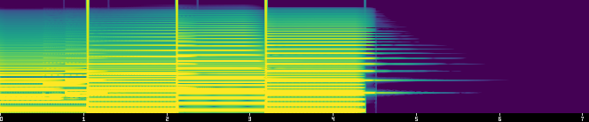
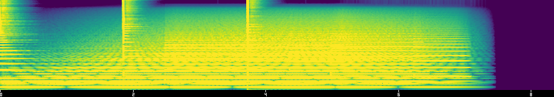
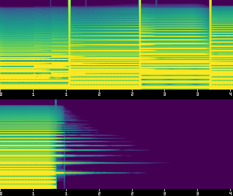

# cochlea

[](https://github.com/richer-richard/cochlea/actions/workflows/ci.yml)
[](https://richer-richard.github.io/cochlea/)

**A headless audio engine for agents.** Write a score as data, render it
offline to deterministic PCM, then *listen through numbers* — loudness,
onsets, pitch, key, spectrograms — and assert what you heard. Compose →
render → probe → verify, with no human ear (and no audio device) in the
loop.



*What the agent sees: the mel spectrogram of `examples/scores/first_light.ron`
— the score used in the example below — after render and probe. No PCM in
sight.*

```rust
use cochlea_score::*;

let score = Score::new(SampleRate(48_000), Ppq(960))
    .time_signature(4, 4)
    .tempo(Ticks(0), Bpm(120.0))
    .track("lead", Instrument::preset("saw_lead"))
    .note("lead", bar(1).beat(1), Dur::quarter(), Pitch::A4, Vel(96))
    .automate("lead", Param::CUTOFF_HZ,
        keys![(bar(1), 400.0, ease_in_out()), (bar(3), 4_000.0)]);

let rendered = cochlea_render::render(&score)?;
rendered.write_wav("mix.wav")?;

use cochlea_verify::{VerifyExt, Tol, Ms, Cents, Db};
let report = rendered.verify(&score)
    .true_peak_below(-1.0)
    .pitch_matches_score("lead", Cents(10.0))
    .monotone("lead", Param::CUTOFF_HZ, bar(1)..bar(3))
    .silent_after(bar(5))
    .run();
assert!(report.passed);
```

Or entirely from the command line, score as RON:

```
cochlea render score.ron --out mix.wav --stems stems/ --verify
cochlea probe input.wav --json report.json --spectro spec.png
cochlea probe input.wav --digest --window-ms 500
cochlea probe input.mp3 --from 42.0 --to 44.5      # zoom into a window, any format
cochlea diff a.wav b.wav --tier2 --spectro delta.png
cochlea lint score.ron
cochlea spectro input.wav --out spec.png --annotate  # draw beats/onsets/pitch on the image
cochlea import song.mid --out score.ron              # SMF -> score, timing exact
cochlea reference    # the full score-authoring reference, generated from the live preset bank
```

`cochlea probe` works on **any** WAV — and FLAC (decoded bit-exact), mp3,
and ogg, still ffmpeg-free — no score required. That's the front door:
point it at audio you didn't render and get the same JSON report and
spectrogram an agent uses to review its own work.

## How an agent listens

compose → render → probe (JSON) → spectrogram (one vision call) → verify

1. **compose** a score as data (RON, or the Rust builder above).
2. **render** it to deterministic PCM — `cochlea render score.ron --out mix.wav`.
3. **probe** the mix into a compact JSON report (loudness, onsets, pitch,
   key, silence, clipping) — `cochlea probe mix.wav --json report.json`.
   No image, no audio: the agent reads numbers.
4. **look**, when numbers aren't enough — `cochlea spectro mix.wav --out
   spec.png` renders one small PNG the agent reviews in a single vision
   call instead of reasoning about raw samples.
5. **verify** — `cochlea render score.ron --verify` runs the score's
   embedded assertions and exits nonzero on failure, so an agent can retry
   without a human confirming "yes, that sounds right."

And when something in the middle of a long file needs a closer listen,
every read tool takes `--from/--to`: probe just bars 17–19, spectrogram
just the drop. The cut is frame-exact, report times are relative to it,
and `source.start_ms` says where it came from — the tier stack becomes a
zoom lens instead of a whole-file-only report.

The economics are the point, not an afterthought. The `first_light` render
above is 7 seconds of 48 kHz/32-bit-float PCM and weighs 2.7 MB; a
3-minute piece at the same settings is ~66 MB — not something to hand an
agent as text, let alone read sample-by-sample. Its probe report is a few
KB of JSON (schema v4, trimmed here to the interesting fields — note
`pitch.melody`: the piece's bass line and melody read back as *note
events*, the compose loop's read-back half):

```json
{
  "schema_version": 4,
  "source": { "sample_rate": 48000, "channels": 2, "duration_ms": 7035.708333333333, "start_ms": 0.0 },
  "loudness": { "integrated_lufs": -22.700454879284784, "true_peak_dbtp": -15.910817022082783, "lra": 10.607660373688798 },
  "onsets": { "count": 6, "times_ms": [1077.33, 2149.33, 2346.67, 3221.33, 4538.67, 5034.67] },
  "pitch": { "voiced_ratio": 0.9847560975609756, "median_f0_hz": 110.00194603797897,
             "melody": [ { "name": "A2", "start_ms": 0.0, "end_ms": 1045.3, "cents_off": 0.1 },
                         { "name": "E2", "start_ms": 1077.3, "end_ms": 2112.0, "cents_off": 0.3 },
                         { "name": "F#2", "start_ms": 2154.7, "end_ms": 3178.7, "cents_off": 0.2 },
                         { "name": "E2", "start_ms": 3210.7, "end_ms": 4384.0, "cents_off": 0.3 },
                         { "name": "E5", "start_ms": 4394.7, "end_ms": 5813.3, "cents_off": -0.4 } ] },
  "timbre": { "mfcc_mean": [-37.64, 14.47, -4.44, 1.24, "..."], "mfcc_std": ["..."], "frames": 656 },
  "key": { "tonic": "E", "mode": "major", "confidence": 0.8093960265638273 },
  "tempo": { "bpm": 55.97014925373134, "confidence": 0.6633739386089712, "stability": 0.3333333333333333,
             "candidates": [ { "bpm": 55.97014925373134, "salience": 0.6633739386089712 },
                             { "bpm": 112.5, "salience": 0.21588204941945222 } ] },
  "rhythm": { "grid_alignment": 0.8333333333333334, "grid": "straight", "offbeat_ratio": 0.4, "clear_rhythm": true },
  "stereo": { "width": 0.02967719705208343, "correlation": 0.9981362354107913, "balance": -0.0016380539212361243 },
  "structure": { "section_count": 1, "confidence": 0.0 },
  "silence": { "trailing_ms": 2485.708333333333 },
  "clipping": { "clipped_samples": 0, "true_peak_over_0dbtp": false }
}
```

And the spectrogram is one small image. Here's the `title_cue` demo — a
pad whose `cutoff_hz` automation sweeps 250 Hz → 5000 Hz across bars 1–3:



*The dark band at the top of the frame narrows as the sweep runs — more
high-frequency energy gets let through over time. An agent reads that
directly off the image; the demo's `Monotone(track: "pad", param:
"cutoff_hz", ...)` assertion checks the same thing numerically.*

For a whole piece in one image regardless of length, `--sheet` tiles the
spectrogram into a contact sheet instead of one long strip (two bars per
tile here, `--bars-per-tile 2`):



## Reading audio without a context window

`probe --digest` skips JSON entirely and prints a deterministic text
summary — one line per feature dimension, then a windowed timeline capped
at ~40 rows. Real output for the `drum_groove` demo (20.8 s, four tracks,
the wave-2 rhythm/stereo/structure dimensions in one screenful):

```
cochlea digest: 20.755s  2ch  48000Hz
loudness: integrated=-24.06  momentary_max=-22.42  true_peak=-5.95  lra=1.61
key: A# minor (conf 0.54)  pitch: voiced=23%  median=63.8Hz (C2 -42.8c)
melody: 6 notes  C2 C2 C2 C2 A1 A1
tempo: 110.3bpm (conf 0.79, stability 1.00)  alts: 54.9bpm(0.89), 36.6bpm(0.79)
rhythm: clear=true  grid_align=0.98 (straight)  offbeat=0.56
stereo: width=0.07 corr=0.99 bal=-0.01
structure: 1 section
onsets: count=58  rate=2.79/s
silence: leading=0ms  trailing=2545ms
clipping: clipped=0  over_0dbtp=false
timeline: window=1000ms  bucket=1x  rows=21
   idx        t(s)     rms   peak  ons     f0  flags
     0   0.000-1.000   -25.55  -7.36    4    64.0  -
     1   1.000-2.000   -25.61  -8.37    3    63.4  -
     ...
```

Tempo and rhythm are reported as *separate axes*, because they change
independently — a drum solo can hold a rock-steady pulse while its
pattern turns unrecognizable, and that difference is exactly what an
agent needs to see. Here the tempo reads 110.3 BPM (matching the
authored 110), `stability 1.00` says the speed never moves across the
piece, and the `alts` list surfaces the genuine half-tempo reading (54.9
BPM, salience 0.89 — actually the stronger raw peak; the octave prior
breaks the tie toward the beat). Metrical ambiguity is data an agent can
weigh, not a coin flip hidden inside the detector. The `rhythm` line
then reports how the *hits* relate to that pulse: 98% of onsets sit on
the beat-subdivision grid, 56% of them on off-beat subdivisions (an
eighth-note hat groove — syncopation as a number), so `clear=true`.
(Under the pre-0.2.0 metric this same groove read `clear_rhythm=false`
at confidence 0.01 — layering hats, kick, snare, and pad across three
metrical levels diluted every lag's share of a mass-fraction score. The
grid-based rule asks the right question instead.)

The `(straight)` tag is the grid *hypothesis test*: alignment is measured
against both straight sixteenths and eighth-note triplets, and the report
carries whichever more hits land on. A shuffle or swing take reads
`grid_align=1.00 (triplet)` — recognized as an aligned triplet rhythm —
instead of being force-fit to sixteenths and scored sloppy.

`cochlea diff` compares two files in feature space instead of byte-for-byte
— "did my change do what I meant," not "is the file bitwise equal." Real
output diffing `first_light.wav` against `title_cue.wav`:

```
verdict: different (duration, loudness, onsets, key)
duration     a->b +1264.3 ms
loudness     integrated -5.95 LU  true_peak +5.70 dB  lra -8.88 LU
onsets       matched=0  mean_offset=-  max_offset=-  unmatched_a=6  unmatched_b=5
pitch        delta +0.5 cents
key          a=E major (conf 0.81)  b=A minor (conf 0.86)  changed=true
segments     max_abs_rms_delta 120.99 dB at idx=7
tempo        bpm -24.01 bpm  stability -0.33
rhythm       clear_rhythm_changed=false  grid_align -0.03  grid_changed=true
timbre       mfcc_distance 4.00
stereo       width +0.14  correlation -0.08  balance -0.01
structure    section_count +0
```

The `timbre` row is an MFCC spectral-shape distance (`c0`, which is just
loudness, excluded): the same instrument re-rendered measures ~0, a
sine-for-saw swap at matched loudness measures well above it — the "did
the re-render keep the instrument's character" axis that loudness and
pitch can't see. Add `--spectro delta.png` and the diff also renders a
**signed difference heat map**: red where B is louder, blue where it's
quieter, black where nothing changed — a moved onset is a blue/red
vertical pair, a brightened sweep a red wedge. What changed becomes
visible structure, not just a number.

Diff a render against itself, or a re-render of the same score, and the
verdict reads `byte-identical` instead — the determinism contract above,
checked from the outside. `--tier2` turns that verdict into a gate: exit
0 for byte-identical or Tier-2-equivalent, exit 1 otherwise, so a CI job
or an agent can catch a regression without ever reading a raw sample.

## Agents as MCP clients

`cochlea-mcp` is a stdio MCP server over the same libraries the CLI uses —
eight tools (`render_score`, `probe_audio`, `spectrogram`, `lint_score`,
`probe_digest`, `audio_diff`, `import_midi`, `score_reference`), each a
thin wrapper over the matching library call, so any MCP client gets the
same compose → render → probe → spectrogram → verify loop as tool calls
instead of shelled-out subprocesses:

```
cargo install cochlea-mcp
claude mcp add cochlea -- cochlea-mcp
```

What makes it agent-native rather than a CLI in a trenchcoat:

- **It teaches itself.** `score_reference` returns the complete authoring
  reference — the RON grammar, the live preset catalog with every
  automatable parameter (generated from the same registry that validates
  scores, so it can't go stale), all `verify:` assertions, and a worked
  example the test suite itself renders. An agent connected cold can
  compose without ever seeing this repo.
- **It shows, not points.** `spectrogram` returns the image *inline* as
  MCP image content (base64 PNG, size-capped), so a client with no
  filesystem access still gets the one-vision-call review; `out_path` is
  optional. `annotate: true` draws the detected beats, onsets, and pitch
  onto the image, and `audio_diff` can return the signed difference heat
  map the same way.
- **It zooms.** `probe_audio` and `spectrogram` take `from_s`/`to_s` —
  lean into 42.0–44.5 s of a long file the way a human replays a bar,
  instead of paying for whole-file analysis every call.
- **It can be confined.** `cochlea-mcp --root DIR` refuses any read or
  write that resolves (canonically — symlinks and `..` included) outside
  `DIR`, before touching the filesystem.

Full tool schemas, arguments, and the JSON-RPC framing are in
[`docs/mcp.md`](docs/mcp.md).

## Install

All nine crates are on [crates.io](https://crates.io/crates/cochlea):

```
cargo install cochlea        # the CLI: render / probe / diff / lint / spectro / reference
cargo install cochlea-mcp    # the MCP stdio server
cargo add cochlea-features   # or any crate as a library dependency
```

Or from source: `git clone https://github.com/richer-richard/cochlea &&
cd cochlea && cargo install --path crates/cli`.

## Concepts

- **Score IR** (`cochlea-score`): tracks, notes, per-parameter automation,
  a tempo map of step changes, an optional master section — all data,
  serializable as RON (`version: 1`, round-trip tested both ways).
  Positions are `bar(3).beat(2)`, durations are exact fractions
  (`Dur::quarter()`, `"3/16"`, dotted/triplet sugar); anything off the
  tick grid is an *error*, never a rounding. Standard MIDI Files import
  with timing intact (`cochlea import` — SMF ticks land on the grid
  verbatim, GM programs map to labeled preset guesses).
- **Integer time is ground truth.** Ticks at 960 PPQ. BPM converts once to
  integer nanoseconds-per-quarter; tick→sample is exact rational u64/u128
  arithmetic (via `fenestra-anim`'s `mul_div`) applied once at
  event-schedule time. No accumulated floating-point seconds, no wall
  clock, property-tested drift-free over 10⁹ ticks.
- **Synth** (`cochlea-synth`): eight presets over [fundsp] — `sine`,
  `saw_lead`, `square_bass`, `chord_pad` (genuinely stereo: its detuned
  saws pan apart), `noise_hat`, `pluck`, `kick`, `snare` — plus a
  `reverb` insert. Instruments declare typed automatable params (name,
  unit, range, default); scores are validated against that registry, and
  the same registry generates the self-describing authoring reference.
  All noise is a counter-based RNG keyed `(seed, sample_index)` — random
  access, no stateful generator anywhere.
- **Renderer** (`cochlea-render`): 64-sample blocks split at event
  boundaries (note timing is sample-accurate; automation is control-rate,
  ~1.3 ms at 48 kHz). Tracks render independently — that's the parallelism
  unit *and* free stems. Voice allocation and oldest-note stealing are
  pure functions of the schedule. The master bus sums stems at f64 in
  fixed track order, then runs the score's optional master stage: an
  output gain and a brick-wall lookahead limiter whose sample-peak
  ceiling holds *exactly* (offline lookahead is a forward window maximum,
  no delay line) — the tool for hitting LUFS targets with `TruePeakBelow`
  headroom. Without a master section, the mix is byte-equal to the sum of
  the stems, by definition and by test.
- **Features** (`cochlea-features`): one schema-versioned JSON report —
  integrated LUFS / momentary max / true peak / LRA (via [ebur128]),
  spectral-flux onsets, YIN pitch with cents deviation plus a quantized
  **melody** (note events an agent can diff against what it wrote), an
  MFCC **timbre** digest, chroma + Krumhansl-Schmuckler key, tempo (pulse
  clarity, octave-alternative candidates, windowed stability) and rhythm
  (grid alignment with a straight-vs-triplet hypothesis test, offbeat
  ratio, a calibrated `clear_rhythm`) as separate axes, stereo
  width/correlation/balance, Foote novelty structure boundaries,
  silence/tail, clipping — plus a windowed segment timeline, an
  LLM-sized text digest, a feature-space diff between two files, and
  frame-exact windowing (`Audio::window`) behind every `--from/--to`.
- **Spectro** (`cochlea-spectro`): mel spectrogram PNGs (HTK filterbank,
  viridis, time ruler, bar markers), analysis overlays (beat grid, onsets,
  pitch drawn on the image), signed A→B difference heat maps, and tiled
  contact sheets so an agent reviews a whole piece in one vision call.
- **Verify** (`cochlea-verify`): the assertion DSL above, also embeddable
  in score RON under `verify:` — `cochlea render score.ron --verify` runs
  them and exits nonzero with a machine-readable JSON failure report.

## Determinism, precisely scoped

Audio is a fold, not a map: filters and delays carry state, so per-sample
purity is not the contract. The contract is three tiers:

| Tier | Claim | Where |
|------|-------|-------|
| 1 | **Byte-identical PCM** for identical inputs | pinned CI target (x86_64-linux, pinned toolchain); same-machine repeatability tested on every platform |
| 2 | **Feature tolerances** across platforms | integrated LUFS ±0.1 LU, onsets ±2 ms, pitch ±5 cents |
| 3 | **Spectrogram sentinels** | image diff with per-pixel tolerance |

What buys Tier 1: the `libm` crate exclusively for transcendentals in DSP
paths (std float methods are *banned by clippy config*, not convention),
no fast-math, no implicit FMA (`mul_add` is banned too), denormals honored
everywhere (flushing is a realtime hack and can't even be done uniformly
across architectures — see `docs/determinism.md`), fixed summation order,
f64 master bus, voices ticked sample-by-sample (fundsp's SIMD block path
provably diverges from its scalar path and is banned), analysis FFTs on
`FftPlannerScalar` (no runtime CPU dispatch). The full audit trail — per
fundsp node family, ebur128 internals, rustfft dispatch — lives in
[`docs/determinism.md`](docs/determinism.md).

## Feature accuracy (synthesized ground truth, 48 kHz)

| Feature | Fixture | Measured |
|---------|---------|----------|
| Pitch (YIN) | 440 Hz sine | 440.017 Hz — 0.07 cents off A4 |
| Onsets | click track, 0.5 s grid | ≤ 4 ms offset (frame-center convention, 256-sample hop) |
| Key | C major triad | C major, confidence 0.79 |
| Key | I–IV–V–I pad progression (demo) | C major |
| Loudness | −18 dBFS-peak 997 Hz sine | −21.0 LUFS (≈ −3 LU sine crest factor — physics, not error) |
| Silence/tail | 1 s tone + 1 s silence | trailing 960 ms, last-audible within one RMS window |
| Clipping | driven square, clamped | counted; true-peak-over-0 flagged |
| Tempo | 120/90 BPM click track | ±1 BPM, pulse clarity 0.96, `clear_rhythm=true` |
| Tempo | `drum_groove` demo (110 BPM groove) | 110.29 BPM (Δ 0.01), pulse clarity 0.79, stability 1.0; the 55 BPM half-tempo surfaces as a candidate (salience 0.89) instead of a hidden coin flip |
| Rhythm | quarter-note clicks vs straight eighths | grid alignment 1.0 for both; offbeat ratio 0.0 vs 0.49 — syncopation as a number |
| Rhythm robustness | click track, ±5/±10 ms human timing jitter | BPM exact, alignment 1.0, `clear_rhythm` holds (clarity 0.77 / 0.51) |
| Rhythm robustness | click track, ±20/±30 ms jitter | BPM octave-folds to the half tempo (smeared beats make the two-beat lag as clear as one) — but alignment stays 1.0 and `clear_rhythm` holds |
| Rhythm robustness | one dropped + one extra hit in 22 | BPM and `clear_rhythm` unaffected |
| Rhythm false-positive guard | uniformly random onset times | alignment 0.57 (vs the 0.7 clear-rhythm bar), pulse clarity 0.10 — rejected on two independent gates |
| Tempo vs rhythm | pattern change at constant speed (quarters → dense eighths) | stability stays ≥ 0.75 — the drum-solo case: the *rhythm* changed, the *speed* didn't |
| Tempo vs rhythm | real speed change (100 → 140 BPM mid-buffer) | stability drops ≤ 0.75 — the axis that separates the two |
| Swing | shuffle (beats + upbeats at 2/3 beat) | `grid: triplet`, alignment 1.0, `clear_rhythm` holds — recognized, not scored sloppy |
| Melody | three authored tones (A4 C5 E5) | reads back as `A4 C5 E5`, starts within 60 ms, centers within 5 cents |
| Timbre | sine vs saw, same note, same level | MFCC distance separates decisively; identical input measures exactly 0 |
| Lossy decode | the same tone via WAV, mp3, and ogg | pitch agrees within 5 cents across codecs |
| Structure | two 8 s segments, distinct timbre | boundary within 1.5 s of the true 8.0 s cut |
| Structure | three 8 s segments (A/B/A) | boundaries within 1.5 s of the true 8.0 s and 16.0 s cuts |

## ffmpeg-free by design

cochlea reads WAV, FLAC, mp3, and ogg/vorbis (`hound` and `symphonia`,
both pure Rust), writes plain WAV, and renders PNGs on the CPU (`rustfft`
+ hand-rolled mel filterbank + viridis LUT + `image`). No subprocess
calls, no system codecs, no GPU, no audio device — the entire pipeline is
a pure Rust dependency graph, and CI bans GUI/GPU/device crates from ever
entering `Cargo.lock` (`deny.toml`). Two decode contracts, stated where
they live: WAV/FLAC decode **bit-exact** (FLAC is lossless by spec,
checked against WAV twins in-tree); mp3/ogg are **analysis input only** —
reproducible per build, but a codec already threw the original samples
away, so no exactness claim exists to make.

## Assertion cookbook

```rust
use cochlea_verify::{VerifyExt, Tol, Ms, Cents, Db};

rendered.verify(&score)
    // Mix-level loudness and headroom:
    .integrated_lufs(-14.0, Tol(0.5))     // streaming-loudness target
    .true_peak_below(-1.0)                 // intersample-safe headroom
    // Timing: did the hit land where the score says?
    .onset_at("drums", bar(17).beat(1), Ms(5.0))
    // Intonation: does every note read as written? (monophonic tracks)
    .pitch_matches_score("lead", Cents(10.0))
    // Was the sweep *written*? (authored curve, block-rate — a score lint)
    .monotone("lead", Param::CUTOFF_HZ, bar(1)..bar(3))
    // ...and did it audibly *happen*? (rendered stem's spectral centroid)
    .brightness_rises("lead", bar(1)..bar(3), 1.3)
    // Do the hits land on the detected beat grid?
    .grid_alignment_at_least(0.9)
    // Click detection away from note boundaries:
    .no_discontinuity("lead", Db(40.0))
    // Does the piece actually end?
    .silent_after(bar(64))
    .run();
```

The same assertions embed in score RON:

```ron
verify: [
    IntegratedLufs(target: -14.0, tol: 0.5),
    TruePeakBelow(dbtp: -1.0),
    OnsetAt(track: "drums", at: (17, 1), tol_ms: 5.0),
    PitchMatchesScore(track: "lead", tol_cents: 10.0),
    Monotone(track: "pad", param: "cutoff_hz", from: (1, 1), to: (3, 1), direction: Rising),
    BrightnessRises(track: "pad", from: (1, 1), to: (3, 1), min_ratio: 1.3),
    NoDiscontinuity(track: "lead", db: 40.0),
    SilentAfter(at: (64, 1)),
    TempoIs(bpm: 110.0, tol_bpm: 2.0),
    HasClearRhythm(expected: true),
    GridAlignmentAtLeast(min: 0.9),
]
```

`cochlea render score.ron --verify` runs them; failures come back as JSON
(`{"passed": false, "checks": [...]}`) and a nonzero exit.

To actually *hit* a loudness target rather than just assert it, give the
score a master bus — gain to push, a limiter to hold the ceiling:

```ron
master: Master(
    gain_db: 4.0,
    limiter: Limiter(ceiling_db: -2.0),   // sample-peak ceiling holds exactly
),
verify: [
    IntegratedLufs(target: -14.0, tol: 0.5),
    TruePeakBelow(dbtp: -1.0),   // ~1 dB headroom over the ceiling: true peak is inter-sample
]
```

Four worked demos live in [`demos/`](demos/): `metronome` (sample-exact
scheduling, onset tolerances), `chord_pad` (harmony reads as written),
`title_cue` (a four-bar cinematic sting asserting a LUFS target, a
monotone filter sweep, click-freedom, and silence after the fade), and
`drum_groove` (a 110 BPM eight-bar groove on the real `kick` and `snare`
patches, hats panned right and snare left, asserting detected tempo,
`HasClearRhythm(true)` with grid alignment ≥ 0.9, stereo width, loudness
range, and section count — the fixture that motivated the tempo/rhythm
split, since the old confidence metric read it as rhythm-less at 0.01
despite a spot-on BPM).

## Workspace

```
crates/
  score      # IR: ticks, tempo map, bar/beat math, notes, automation, master, RON form, MIDI import
  synth      # Patch trait over fundsp, eight presets, param registry, counter RNG
  render     # block engine, voices, stems, f64 master sum + gain/limiter, WAV out
  features   # LUFS/true peak, onsets, pitch+melody, timbre, chroma/key, tempo, rhythm, stereo, structure
  decode     # WAV + FLAC (bit-exact) + mp3 + ogg (analysis) -> Audio, pure Rust
  spectro    # mel spectrogram -> PNG, overlays, diff heat maps, contact sheets
  verify     # assertion DSL + RON-embeddable specs + JSON reports
  cli        # the `cochlea` binary
  mcp        # MCP stdio server (agents call compose/render/probe/verify as tools)
```

`features` and `spectro` depend on neither `score` nor `synth` — enforced
in CI — which is why `probe` works on arbitrary audio files with no score
in sight.

## License

MIT OR Apache-2.0, at your option.

[fundsp]: https://crates.io/crates/fundsp
[ebur128]: https://crates.io/crates/ebur128
